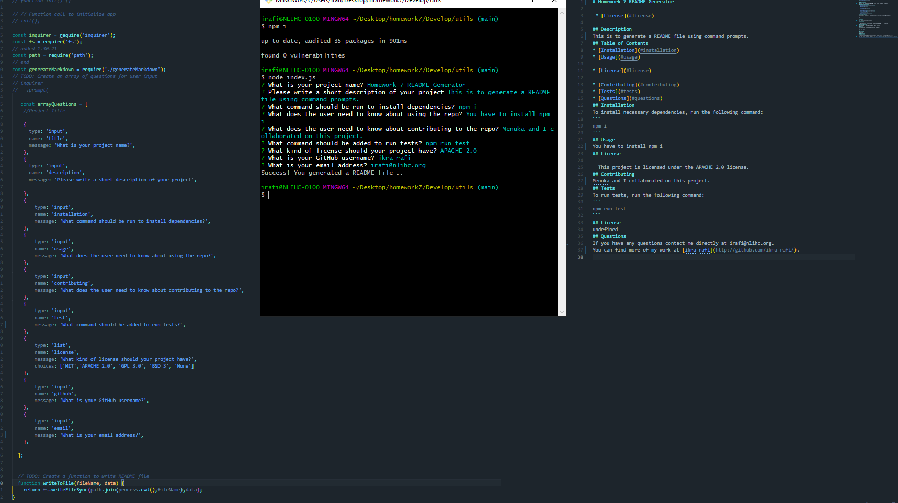

# homework7
Title: Readme.md Generator 
Description:
This is a command-line application that dynamically generates a professional README.md file from a user's input using the [Inquirer package](https://www.npmjs.com/package/inquirer). 

# ScreenShots and Walkthrough Video
https://drive.google.com/file/d/1BxOk7wWtVfLLXs0vUJB2nb5Jew6CWRXS/view

# Credit
Menuka
-------------------------------------
# Installation and Usage: 
Step by Step instructions to demonstrate functionality:
Link to walkthrough video: 

1. These are basic instructions to install the command-line application and generate your own README file. 

2. Open terminal or gitBash and run npm install for the correct npm package dependencies

3. This application can be invoked with node index.js

When you run node index.js, the application uses the inquirer package to prompt you in the command line with a series of questions about your project. From there, the application will generate markdown and a table of contents for the README conditionally based on your responses tother inquirer prompts.

Finally, fs.writeFile is used to generate your project's README.md file . Check out the example README.md in this this repo as an example. Check under Develop>Utils.
